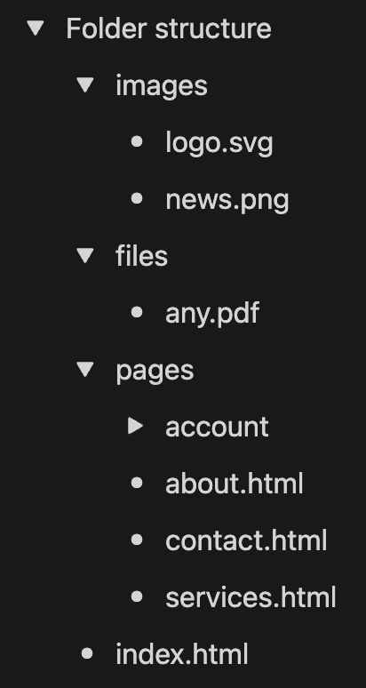

# Lesson - 03

- Attributes
  - Common
  - Style attribute
- Block and inline elements
- div and span
- Lists
  - ol
  - ul
- Folder structure


<br><br><br><br><br>


# `Attributes`

<br>

##  Common

 - title
 - contenteditable

<br><br>

## Style attribute

### Syntax

 ```
 <tagName style="property1: value; property2: value;">Content</tagName>
 ```
<br>

### Properties
- color
- font-size
- text-align
- background-color

---

<br><br><br><br><br>

# `Block and inline elements`

<br>

 ## A block element always takes up the full width available.

- Heading tags
- Paragraph tags
- blockquote, center, address, marquee

<br>

## An inline element only takes up as much width as necessary. (formatting)

- Formatting tags
- abbr, button, time, img, a

<br><br><br><br><br>

# `div` and `span`


The `<div>` tag is an block element, stands for division and used to divide content into logical sections;

<br>

The `<span>` tag is an inline element used to mark up a part of a text or a part of a document;

<br><br><br><br><br>

# `Lists`

<br>

## `ol` - ordered list

> Attributes - `type`, start;

<br>

## `ul` - unordered list

> Style properties - `list-style-type`


<br><br><br><br><br>

# `Folder structure`

<br>

