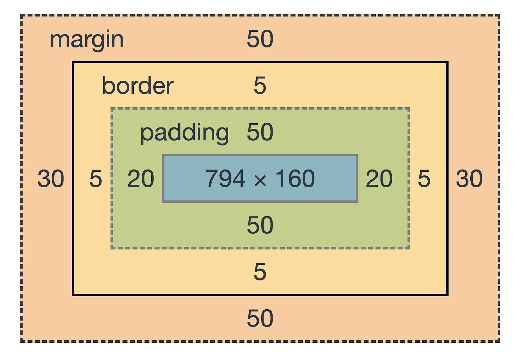
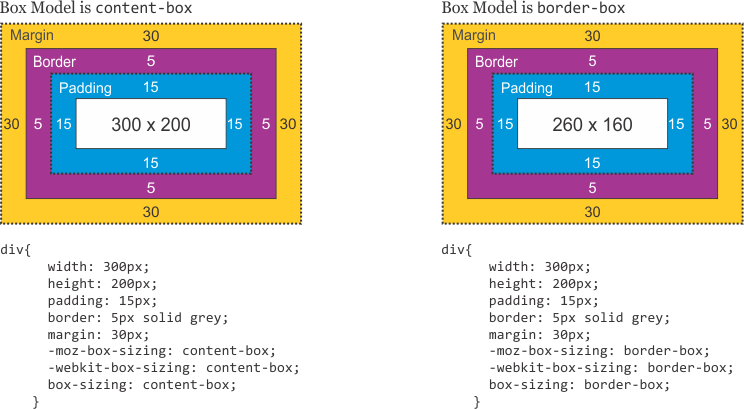

<h1 style="color:orange;">Lesson - 02 | html & Css3</h1>

## Html
- Table in Html
- Button (tag html)
- input (tag html)
  - placeholder
- Form (tag html)
- option (tag html)


## CSS
- Display
  - inline
  - block
  - inline-block
  - none
- px
- Padding & Margin
- Box model
- Box-sizing

<br><br><br><br><br><br>

<h1 style="color:yellow;">Html table</h1>

| Tag       | Ma'nosi                          |
| --------- | -------------------------------- |
| `<table>` | Jadval boshlanishi               |
| `<thead>` | Jadval sarlavha qismi            |
| `<tbody>` | Jadval asosiy qismi              |
| `<tr> `   | Yangi qator (table row)          |
| `<th> `   | Jadval sarlavhasi (bold bo‘ladi) |
| `<td>`    | Oddiy katak (table data)         |

<br><br><br><br>

<h1 style="color:yellow;">Button</h1>

> `<button>` tegi HTML'da tugma yaratish uchun ishlatiladi. U juda qulay va ko‘p funksiyali teg, ayniqsa input type="submit" yoki type="button"ga nisbatan ko‘proq imkoniyatlar beradi, chunki ichiga matn, `<span>`, `<i>`, `` kabi boshqa elementlarni ham joylashtirish mumkin.

<br>

### `<button>` ning type qiymatlari:

| type qiymati | Tavsifi                           |
| ------------ | --------------------------------- |
| submit       | Formani yuboradi (default qiymat) |
| reset        | Formani tozalaydi                 |
| button       | Oddiy tugma                       |

<br><br><br><br>

<h1 style="color:yellow;">input</h1>

> `<input>` HTML tegi — foydalanuvchidan turli xil ma'lumotlarni olish uchun ishlatiladi. Har bir input turi, foydalanuvchidan ma'lumot yig'ish jarayonini boshqarish uchun type atributidan foydalanadi.

<br>

## HTML `<input>` `type` atributining barcha turlari

Quyida HTMLdagi `<input>` elementining eng ko‘p ishlatiladigan `type` turlari va ularning vazifalari keltirilgan.

| Type             | Tavsif                                            |
| ---------------- | ------------------------------------------------- |
| `text`           | Oddiy matn kiritish uchun                         |
| `password`       | Parol kiritish, belgilar yashirin bo‘ladi         |
| `email`          | Email manzil kiritish uchun                       |
| `search`         | Qidiruv formasi uchun                             |
| `tel`            | Telefon raqami kiritish uchun                     |
| `url`            | URL manzil (https://...) kiritish uchun           |
| `date`           | Sana tanlash uchun                                |
| `month`          | Faqat oy va yil tanlash uchun                     |
| `week`           | Yil va hafta tanlash uchun                        |
| `time`           | Soat:daqiqa formatda vaqt kiritish                |
| `datetime-local` | Sana va vaqtni birga tanlash uchun (timezonessiz) |
| `number`         | Raqam kiritish uchun (min, max, step ishlaydi)    |
| `range`          | Slayder (diapazon) uchun                          |
| `checkbox`       | Bir yoki bir nechta variantni tanlash             |
| `radio`          | Bitta variantni tanlash (radio button)            |
| `file`           | Fayl yuklash uchun                                |
| `image`          | Surat orqali submit qilish (tasvirli button)      |
| `submit`         | Formani jo‘natish uchun tugma                     |
| `reset`          | Formani tozalash uchun tugma                      |
| `button`         | Oddiy tugma, JavaScript orqali ishlatiladi        |
| `hidden`         | Foydalanuvchiga ko‘rinmaydigan qiymat yuborish    |

---

<br><br><br><br>

<h1 style="color:yellow;">Form</h1>

> `form` — bu foydalanuvchidan ma'lumot olish uchun ishlatiladigan HTML elementi.

<br>

## Formaning ichida ishlatiladigan asosiy teglar:

- `<input>` — matn, parol, email, checkbox va h.k.
- `<textarea>` — ko‘p qatordan iborat matn kiritish maydoni.
- `<select>` — drop-down menyu (ro‘yxatdan tanlash).
- `<button>` yoki `<input type="submit">` — yuborish tugmasi.
- `<label>` — inputga bog‘langan matn.

<br><br><br><br>

<h1 style="color:yellow;">option</h1>

> `<option>` tegi `<select>` tegi ichida ishlatiladi va tanlanadigan variantlarni ifodalaydi.

<br>

## `<option>` tegidagi — Muhim atributlar

| Atribut    | Tavsif                                                                                                                                   |
| ---------- | ---------------------------------------------------------------------------------------------------------------------------------------- |
| `value`    | Serverga yuboriladigan haqiqiy qiymat                                                                                                    |
| `selected` | Standart holatda tanlangan bo‘lishi kerak bo‘lgan variantni belgilaydi                                                                   |
| `disabled` | Foydalanuvchi tanlay olmaydigan, faollashtirilmagan holatdagi variant                                                                    |
| `label`    | Ko‘rinadigan matnni aniqlaydi (odatda to‘g‘ridan-to‘g‘ri `<option>` ichida yoziladi, lekin `label` atributi orqali ham berilishi mumkin) |

<br><br><br><br>

<h1 style="color:yellow;">Display</h1>

- inline
- block
- inline-block
- none

<br>

>CSS'da `display` xossasi elementning sahifadagi qanday ko‘rinishini (joylashishini) belgilaydi. Quyida eng ko‘p ishlatiladigan qiymatlar keltirilgan:

| Qiymat         | Tavsif |
|----------------|--------|
| `inline`       | Element yonma-yon joylashadi, eni va bo‘yiga o‘lcham berib bo‘lmaydi. Masalan: `<span>`, `<a>` |
| `block`        | Element yangi qatordan boshlanadi va butun eni bo‘ylab joy egallaydi. Masalan: `<div>`, `<p>` |
| `inline-block` | `inline` kabi yonma-yon joylashadi, lekin `block` kabi o‘lcham berish mumkin (`width`, `height` ishlaydi) |
| `none`         | Element butunlay yashiriladi, sahifada joy egallamaydi (hatto ko‘rinmaydi ham) |


<br><br><br><br>

<h1 style="color:yellow;">px</h1>

>CSS'dagi `px` — bu **piksel** degan ma'noni anglatadi va bu eng asosiy, **statik o‘lchov birligi** hisoblanadi.


### `px` nima?

- `px` (piksel) — ekranning **bitta nuqtasi** (dot) sifatida tasvirlanadi.
- Bu qiymat **aniq** va **doimiy**: ya'ni `1px` har doim 1 birlik pikselni bildiradi (foydalanuvchi qurilmasi zichligiga qarab nisbatan o‘zgarishi mumkin, lekin CSS kontekstida u qat’iy hisoblanadi).
- Ekrandagi har bir elementning **o‘lchami**, **bo‘shligi**, **chegarasi** va boshqa xossalari `px` bilan o‘lchanishi mumkin.

<br><br><br><br>

<h1 style="color:yellow;">Padding & Margin</h1>

## `padding` va `margin` — CSS qoidasini

- **`padding`** — elementning **ichki bo‘shligi**. Kontent va chegara o‘rtasidagi masofani boshqaradi.
- **`margin`** — elementning **tashqi bo‘shligi**. Elementlar orasidagi masofani boshqaradi.


### Padding:
>padding: `top` `right` `bottom` `left`;  /* 4 tomonga bo‘lingan padding */

### Margin:
>margin: `top` `right` `bottom` `left`;   /* 4 tomonga bo‘lingan margin */

<br><br><br><br>

<h1 style="color:yellow;">Box Model</h1>



<br><br><br><br>

<h1 style="color:yellow;">Box-sizing</h1>

>`box-sizing` — bu CSS xossasi bo‘lib, elementning eni va bo‘yini (width va height) qanday hisoblashni belgilaydi.


## Ikki asosiy qiymati bor:

###  1. content-box (standart qiymat)

>`width` va `height` faqat kontent o‘lchamiga tegishli bo‘ladi.

>`padding` va `border` esa qo‘shimcha o‘lcham sifatida hisoblanadi.

```
.box {
  width: 100px;
  padding: 20px;
  border: 5px solid black;
  box-sizing: content-box;
}
```
> Bu holatda element umumiy eni:
`100 + 20*2 (padding) + 5*2 (border) = 150px` bo‘ladi.


### 2. border-box (tavsiya qilinadigan)

>`width` va `height` hammasini `content + padding + border` o‘z ichiga oladi.
Ya'ni umumiy o‘lcham o‘zgarmaydi.

```
.box {
  width: 100px;
  padding: 20px;
  border: 5px solid black;
  box-sizing: border-box;
}
```

>Bu holatda element umumiy eni faqat `100px` bo‘ladi.
Kontent avtomatik kichrayadi, lekin tashqi o‘lcham o‘zgarmaydi.

<br>

